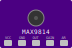

# MAX9814 Electret Microphone Amplifier — Wokwi Custom Chip

A [Wokwi](https://wokwi.com/) custom chip simulating the **MAX9814** electret microphone amplifier with automatic gain control ([Adafruit 1713](https://www.adafruit.com/product/1713) breakout).

<p align="center">
  
</p>

## Usage

Add this chip to any Wokwi project by referencing this repository in your `diagram.json`:

```json
{
  "version": 1,
  "author": "Your Name",
  "editor": "wokwi",
  "parts": [
    { "type": "wokwi-esp32-devkit-v1", "id": "esp" },
    { "type": "chip-MAX9814", "id": "mic1", "attrs": { "amplitude": "0.3", "frequency": "1000" } }
  ],
  "connections": [
    ["esp:3V3", "mic1:VCC", "red", []],
    ["esp:GND.1", "mic1:GND", "black", []],
    ["esp:34", "mic1:OUT", "green", []]
  ],
  "dependencies": {
    "chip-MAX9814": "github:7ax/wokwi-chip-max9814@2.0.0"
  }
}
```

### Example: ESP32 (3.3V)

```cpp
const int MIC_PIN = 34;

void setup() {
  Serial.begin(115200);
  analogReadResolution(12);
}

void loop() {
  int raw = analogRead(MIC_PIN);
  float voltage = raw * 3.3 / 4095.0;
  Serial.printf("ADC: %4d  Voltage: %.3fV\n", raw, voltage);
  delay(50);
}
```

### Example: Arduino Uno (5V)

```cpp
const int MIC_PIN = A0;

void setup() {
  Serial.begin(115200);
}

void loop() {
  int raw = analogRead(MIC_PIN);
  float voltage = raw * 5.0 / 1023.0;
  Serial.print("ADC: "); Serial.print(raw);
  Serial.print("  Voltage: "); Serial.print(voltage, 3); Serial.println("V");
  delay(50);
}
```

The chip reads VCC from the power pin and adjusts its output clamp automatically. The DC bias (1.23V) is an internal reference independent of VCC.

## Pins

| Pin  | Description                              |
|------|------------------------------------------|
| VCC  | Power supply (2.7V–5.5V, read from pin) |
| GND  | Ground                                   |
| OUT  | Analog audio output (DC bias 1.23V)      |
| GAIN | Gain selection (see below)               |
| AR   | Attack/Release ratio (see below)         |

### GAIN Pin Behavior

| GAIN wiring   | Real MAX9814 | Simulation     |
|---------------|-------------|----------------|
| Floating      | 60 dB       | 60 dB (1.0x)   |
| Connected GND | 50 dB       | 50 dB (0.316x) |
| Connected VCC | 40 dB       | 60 dB *         |

\* The GAIN pin uses an internal pull-up to default to 60 dB when floating. Since VCC also reads HIGH, it cannot be distinguished from floating in digital simulation. To reduce output amplitude, use the amplitude slider control instead.

### AR Pin Behavior

| AR wiring     | Real MAX9814 | Simulation   |
|---------------|-------------|--------------|
| Floating      | 1:4000      | 1:4000       |
| Connected GND | 1:500       | 1:500        |
| Connected VCC | 1:2000      | 1:4000 *     |

\* Same limitation as GAIN: VCC reads as floating (HIGH) in digital simulation.

The AR ratio controls how slowly gain recovers after AGC compression. A larger ratio means slower release (e.g., 1:4000 means release takes 4000x longer than attack).

## Controls

| Control       | Range       | Default | Description                             |
|---------------|-------------|---------|------------------------------------------|
| Amplitude     | 0.0 – 1.0  | 0.3     | Audio signal amplitude (0=silent)        |
| Frequency     | 100 – 4000  | 1000    | Tone frequency in Hz                     |
| AGC Threshold | 0.5 – 1.3  | 0.8     | AGC activation threshold in volts        |

## Output Behavior

The OUT pin produces a sine wave centered at 1.23V (MAX9814 internal DC bias reference, datasheet typical):

- **Amplitude 0:** Constant ~1.23V (silence)
- **Amplitude 1.0, no AGC:** Full swing 0V to 2.46V
- **Amplitude 0.3:** Swings ~0.861V to ~1.599V

Small random noise (430µVrms, matching datasheet) is added for realism. The noise is fixed and not amplitude-dependent.

### Automatic Gain Control (AGC)

The MAX9814's defining feature is its AGC, which compresses loud signals to prevent clipping. The simulation models this as a VGA (Variable Gain Amplifier) with 20dB range:

**How it works:**
1. When the uncompressed signal peak (`amplitude × gain × 1.23V`) exceeds the AGC threshold, the AGC activates
2. **Attack:** VGA gain reduces quickly (~1128µs with CT=470nF) to compress the signal
3. **Hold:** Gain is held constant for 30ms after convergence
4. **Release:** If the signal drops below threshold, gain slowly recovers (controlled by AR ratio)

**Example:** At amplitude=0.8 (default gain=60dB):
- Uncompressed peak = 0.8 × 1.0 × 1.23 = 0.984V
- AGC threshold = 0.8V → AGC activates
- VGA compresses gain to ~0.813x so peak ≈ 0.8V

**At default settings (amplitude=0.3):** Uncompressed peak = 0.369V < 0.8V threshold. AGC stays idle — no compression applied.

## Building from Source

Requires [WASI SDK](https://github.com/WebAssembly/wasi-sdk):

```bash
export WASI_SDK_PATH=/opt/wasi-sdk
make
```

Output: `dist/chip.wasm`

### Release Workflow

1. Push source changes to `main`
2. GitHub Actions builds `dist/chip.wasm` and commits it automatically
3. Create a tag on the commit that contains the compiled WASM: `git pull && git tag v2.0.0 && git push --tags`
4. Users reference it as `github:7ax/wokwi-chip-max9814@2.0.0`

## License

MIT — see [LICENSE](LICENSE).
